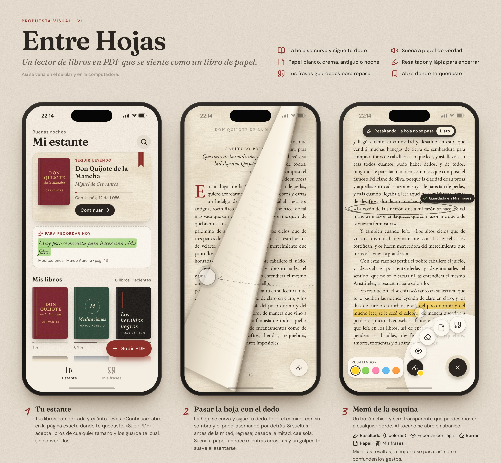
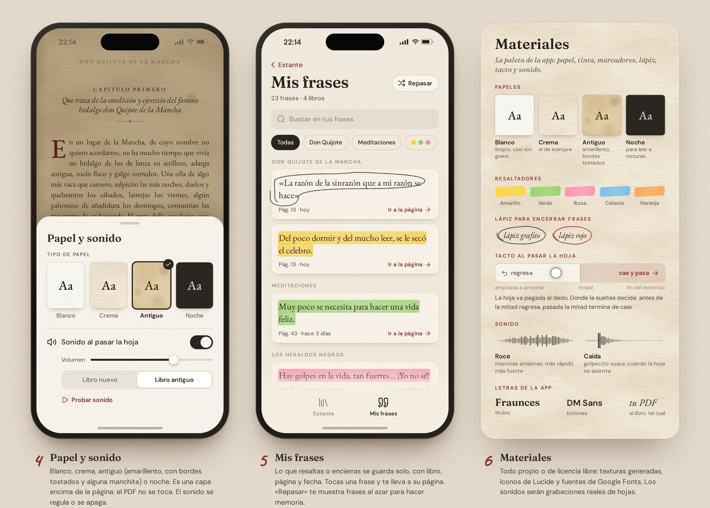
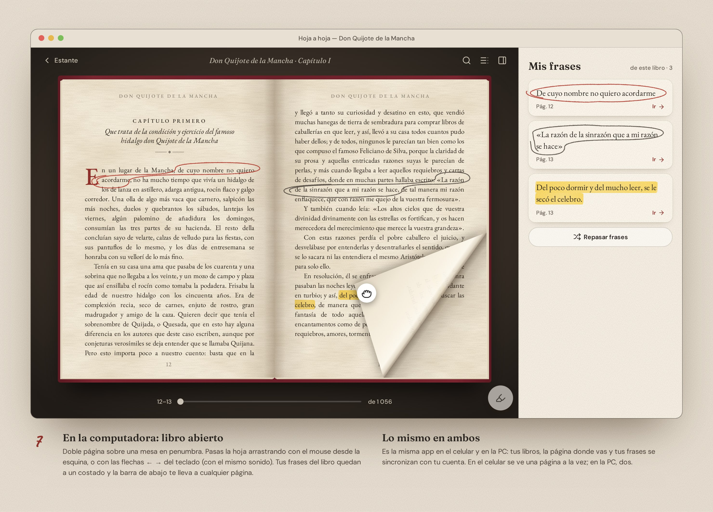

# Entre Hojas — lector de libros en PDF

Un lector de libros en PDF que se siente como un libro de papel: la hoja se curva y sigue tu dedo, suena a papel,
puedes elegir el tipo de papel (blanco, crema, antiguo o noche), resaltar o encerrar frases a lápiz y guardarlas en
«Mis frases» para repasarlas. Recuerda dónde te quedaste. Se abrirá con un enlace en el celular y en la computadora.

La visión completa, el diseño y las decisiones técnicas están en [`CLAUDE.md`](./CLAUDE.md).

## Estado

| Etapa | Qué incluye | Estado |
| --- | --- | --- |
| 0 | Propuesta visual (maqueta e imágenes) | ✅ hecha |
| 1 | Subir PDF, pasar la hoja con el dedo (curva + sonido), 4 papeles, recordar la página | ✅ hecha |
| 2 | Menú de la esquina: resaltador, lápiz para encerrar, borrador y «Mis frases» | ⏳ |
| 3 | Estante con varios libros, doble página en la PC, instalar en el celular, sin internet | ⏳ |
| 4 | Inicio de sesión y sincronización entre celular y PC (Supabase) | ⏳ |

**La app:** https://renzomoran9.github.io/Lectura/

## Etapa 1: cómo funciona

- **Subir un PDF de cualquier tamaño.** Se guarda tal cual en el navegador (OPFS; si no hay, IndexedDB)
  y se pide almacenamiento persistente. PDF.js lo lee por partes (rangos de 64 KB) desde el archivo
  guardado, así que nunca se carga entero. Con libros enormes, el documento se vuelve a abrir cada
  ~160 MB leídos para soltar la memoria que PDF.js acumula.
- **La hoja** (`src/hoja/`) es WebGL propio: una malla que se enrolla sobre un cilindro. Hacia adelante,
  el punto que tomas va pegado al dedo; hacia atrás, la hoja anterior vuelve desde el lomo. Al soltar
  solo cuenta la posición: antes de la mitad del recorrido regresa, pasada la mitad cae. Tiene luz,
  sombra sobre la página de abajo y reverso con el texto al revés, apenas visible.
- **Sonido** (`src/sonido/`): un roce en bucle cuyo volumen y brillo siguen la velocidad de la hoja, y un
  golpecito al asentarse. Dos juegos: «libro nuevo» y «libro antiguo».
- **Papel**: la página del PDF se multiplica con una textura de ruido (`feTurbulence`); en «noche» se
  invierte la luz con un tono cálido. El PDF nunca se modifica.
- **Recordar la página**: el avance de cada libro se guarda en IndexedDB y el libro se abre ahí.

## Desarrollo

```bash
npm install
npm run dev        # http://localhost:5173/Lectura/
npm run typecheck  # tipos
npm test           # pruebas (geometría de la hoja y disposición)
npm run build      # compila en dist/
```

Cada push a `main` (o a una rama `claude/…`) pasa por GitHub Actions (`.github/workflows/publicar.yml`):
revisa tipos, corre las pruebas, compila y publica en la rama `gh-pages`.

El libro de muestra se genera con `node scripts/generar-muestra.cjs` (usa Playwright).

## Propuesta visual





La maqueta es `diseno/propuesta-visual.html` (ábrela en el navegador). Para volver a generar las imágenes:
`node diseno/render.cjs` (necesita el paquete `playwright`).

## Licencias de terceros

- Fuentes EB Garamond, Fraunces, DM Sans y Caveat (`diseno/fuentes/`): SIL Open Font License 1.1, vía Fontsource.
- Íconos de [Lucide](https://lucide.dev) (`diseno/iconos.js`): licencia ISC.
- Texto de muestra: *Don Quijote de la Mancha*, Miguel de Cervantes (1605), dominio público.
- [PDF.js](https://github.com/mozilla/pdf.js) (`pdfjs-dist`): Apache-2.0. Sus recursos (mapas de caracteres,
  fuentes estándar, módulos wasm) se publican en `pdfjs/` con sus licencias.
- React, Zustand e idb: licencia MIT.
- Sonidos (`public/sonidos/`): generados con ElevenLabs para este proyecto; ver `public/sonidos/LICENCIA.md`.
- Libro de muestra (`public/muestra/`): texto de Cervantes (dominio público) compuesto con EB Garamond (OFL 1.1).
